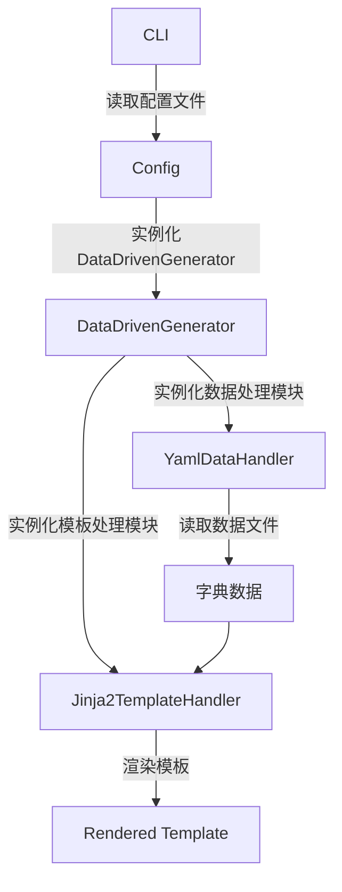

# 基础渲染示例

此文档介绍如何使用 DataDrivenGenerator 进行简单的模板渲染。

## 1. 简介

- **数据源**：数据源负责可以是任意的类型，例如`JSON`, `YAML`等。Generator根据指定的`data_type`进行数据模型的处理，最终将存储为字典数据。
- **模板引擎**：Jinja2，负责模板的渲染。

## 2. 使用方法

使用python运行cli\.py，并输入一个config.yaml配置文件

```bash
python cli.py ./example_config.yaml
```

## 3. 示例文件

### 3.1 example_config.yaml

cli将使用命令行指定的配置文件进行处理。

```yaml
# 数据处理器配置
data_type: yaml # 使用Yaml作为数据处理器
data_config:
  root_path: .\expr_test\data  # 数据树根目录
  file_pattern: ["*.yaml"] # 匹配的文件模式
  preserved_template_key: "TEMPLATE" # 保留的模板键
  preserved_children_key: "CHILDREN" # 保留的子节点键

# 模板处理器配置
template_type: jinja # 使用Jinja2作为模板处理器
template_config:
  template_dir: .\expr_test\template # 模板目录
  preserved_children_key: "children_text" # Jinja2模板中保留的子节点键
  autoescape: false # 是否xml转义

# 要处理的入口文件
patterns:
  - "*.yaml" # 代表在data_config中指定的根目录下查找所有yaml文件

# 输出目录
output_dir: .\expr_test\output
```

1. DataDrivenGenerator将会根据指定的`data_type`以及`template_type`, 创建对应的DataHandler和TemplateHander.
2. DataHandler负责进行字典数据的处理，TemplateHandler负责将字典数据在指定模板中渲染。

### 3.2 字典数据data.yaml

```yaml
### Preserved Key
TEMPLATE: template.j2 # 指定模板路径
CHILDREN: # 指定子数据节点

### User Data
paragrahs:
  - "Paragrah 1"
  - "Paragrah 2"
  - "Paragrah 3"

titles:
  Title1: hahaha
  Title2: ahahah
```

### 3.3 模板template.j2

```jinja2
<html>
    
    <p>{{ paragrah }}</p>
    

    
    <h1>{{key}}</h1>
        <p>{{value}}</p>
    
</html>
```

## 4. 执行流程



## 5. 输出结果

```xml
<html>
    <p>Paragrah 1</p>
    <p>Paragrah 2</p>
    <p>Paragrah 3</p>

    <h1>Title1</h1>
        <p>hahaha</p>
    <h1>Title2</h1>
        <p>ahahah</p>
</html>
```
