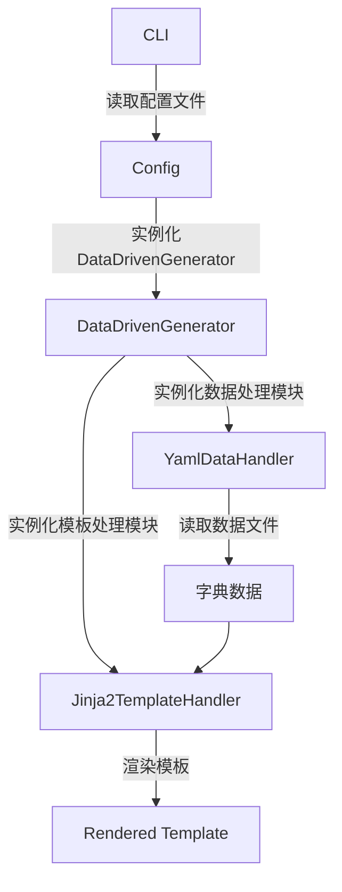

# 基础渲染示例（Basic Render Example）

本示例展示如何使用 DataDrivenGenerator 进行简单的 Jinja2 模板渲染，适合初学者快速上手。

---

## 1. 示例简介

- **数据源**：支持 YAML/JSON 等格式，最终会被解析为 Python 字典。
- **模板引擎**：Jinja2，负责将数据渲染为最终文本（如 HTML/XML）。

---

## 2. 快速开始

### 步骤 1：准备环境

确保已安装依赖（如未安装 Jinja2，可通过 `pip install jinja2` 安装）。

### 步骤 2：运行示例

在命令行中进入本目录，执行：

```bash
python ../../cli/cli.py ./example_config.yaml
```

---

## 3. 示例文件说明

### 3.1 配置文件 example_config.yaml

```yaml
# 数据处理器配置
data_type: yaml                # 使用 YAML 作为数据源
data_config:
  root_path: ./source/data     # 数据文件根目录
  file_pattern: ["*.yaml"]     # 匹配所有 YAML 文件
  preserved_template_key: "TEMPLATE"   # 模板路径字段名
  preserved_children_key: "CHILDREN"   # 子节点字段名

# 模板处理器配置
template_type: jinja
template_config:
  template_dir: ./source/template      # 模板文件目录
  preserved_children_key: "children_text" # 模板中子节点变量名
  autoescape: false

# 要处理的数据文件模式
patterns:
  - "*.yaml"

# 输出目录
output_dir: ./source/output
```
> **提示**：可根据实际目录结构调整路径。

### 3.2 数据文件 data.yaml

```yaml
# 指定模板
TEMPLATE: template.j2

# 示例数据
paragrahs:
  - "Paragrah 1"
  - "Paragrah 2"
  - "Paragrah 3"

titles:
  Title1: hahaha
  Title2: ahahah
```
> **说明**：`TEMPLATE` 字段指定渲染所用模板，其他字段为模板变量。

### 3.3 模板文件 template.j2

```jinja2
<html>
    {# 遍历段落列表 #}
    
    <p>{{ paragrah }}</p>
    

    {# 遍历标题字典 #}
    
    <h1>{{key}}</h1>
        <p>{{value}}</p>
    
</html>
```
> **说明**：模板变量与数据文件字段一一对应。

---

## 4. 渲染流程



---

## 5. 输出结果示例

```xml
<html>
    <p>Paragrah 1</p>
    <p>Paragrah 2</p>
    <p>Paragrah 3</p>

    <h1>Title1</h1>
        <p>hahaha</p>
    <h1>Title2</h1>
        <p>ahahah</p>
</html>
```

---

## 6. 常见问题与建议

- 路径请使用相对路径或绝对路径，确保数据和模板文件能被正确找到。
- 如需自定义模板或数据结构，可参考本示例进行扩展。
- 输出文件会自动生成在 `output_dir` 指定目录下。

---
