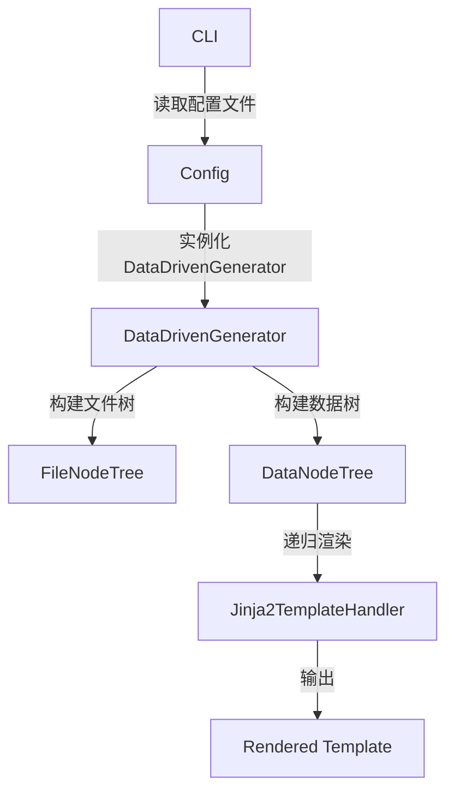

# 数据树渲染示例（Tree Render Example）

本示例展示如何使用 DataDrivenGenerator 递归渲染多层数据结构，适合需要处理父子节点、分组和多模板场景。

---

## 1. 示例简介

- **文件树**：自动扫描数据目录，构建文件与目录的层级关系。
- **字典树**：通过配置和数据文件中的保留键，自动构建父子节点的数据结构。
- **多级模板渲染**：支持递归渲染和子节点分组，适合复杂业务场景。

---

## 2. 快速开始

### 步骤 1：准备环境

确保已安装依赖（如未安装 Jinja2，可通过 `pip install jinja2` 安装）。

### 步骤 2：运行示例

在命令行中进入本目录，执行：

```bash
python ../../cli/cli.py ./example_config.yaml
```

---

## 3. 示例文件说明

### 3.1 配置文件 example_config.yaml

```yaml
data_type: yaml
data_config:
  root_path: ./source/data
  file_pattern: ["*.yaml"]
  preserved_template_key: "TEMPLATE"
  preserved_children_key: "CHILDREN_PATH"
  preserved_children_content_key: "CHILDREN_CONTEXT"

template_type: jinja
template_config:
  template_dir: ./source/template
  preserved_children_key: "CHILDREN_CONTEXT"
  autoescape: false

patterns:
  - "root.yaml"

output_dir: ./source/output
```
> **说明**：`preserved_children_key` 和 `preserved_children_content_key` 控制数据树和模板中子节点的引用。

### 3.2 数据文件结构

- `root.yaml`：根节点，指定子节点分组和模板。
- `children_0/ch0.yaml`、`children_1/ch1.yaml`：子节点数据。
- `services/`、`endpoints/` 等：更深层级的子节点。

#### 示例 root.yaml

```yaml
TEMPLATE: root.j2
CHILDREN_PATH:
  - "services/*.yaml"
  - "children_0/*.yaml"
  - "children_1/*.yaml"
name: Example System
version: 1.0
description: 多层数据树渲染示例
```

### 3.3 模板文件 root.j2

```jinja2
<?xml version="1.0" encoding="UTF-8"?>
<system>
    <info>
        <name>{{ name }}</name>
        <version>{{ version }}</version>
        <description>{{ description }}</description>
    </info>
    <services>
        {{ CHILDREN_CONTEXT[0] | string | indent(8) }}
    </services>
    <children0>
        {{ CHILDREN_CONTEXT[1] | string | indent(8) }}
    </children0>
    <children1>
        {{ CHILDREN_CONTEXT[2] | string | indent(8) }}
    </children1>
</system>
```
> **说明**：`CHILDREN_CONTEXT[index]` 用于引用每组子节点的渲染结果。

---

## 4. 数据与模板树结构说明

### 4.1 文件树

自动扫描 `root_path` 目录，构建如下结构：

```txt
root.yaml
children_0/
  ch0.yaml
children_1/
  ch1.yaml
services/
  web.yaml
  database.yaml
```

### 4.2 数据树与分组

- `CHILDREN_PATH` 为列表，每个元素对应一组子节点。
- 每组子节点渲染结果通过 `CHILDREN_CONTEXT[index]` 在模板中引用。

---

## 5. 渲染流程



---

## 6. 输出结果示例

```xml
<?xml version="1.0" encoding="UTF-8"?>
<system>
    <info>
        <name>Example System</name>
        <version>1.0</version>
        <description>多层数据树渲染示例</description>
    </info>
    <services>
        ...（服务子节点渲染内容）...
    </services>
    <children0>
        ...（children_0 子节点渲染内容）...
    </children0>
    <children1>
        ...（children_1 子节点渲染内容）...
    </children1>
</system>
```

---

## 7. 常见问题与建议

- 路径请使用相对路径或绝对路径，确保数据和模板文件能被正确找到。
- 子节点分组顺序与 `CHILDREN_PATH` 列表顺序一致。
- 模板中可灵活引用各组子节点渲染结果。
- 输出文件会自动生成在 `output_dir` 指定目录下。

---
