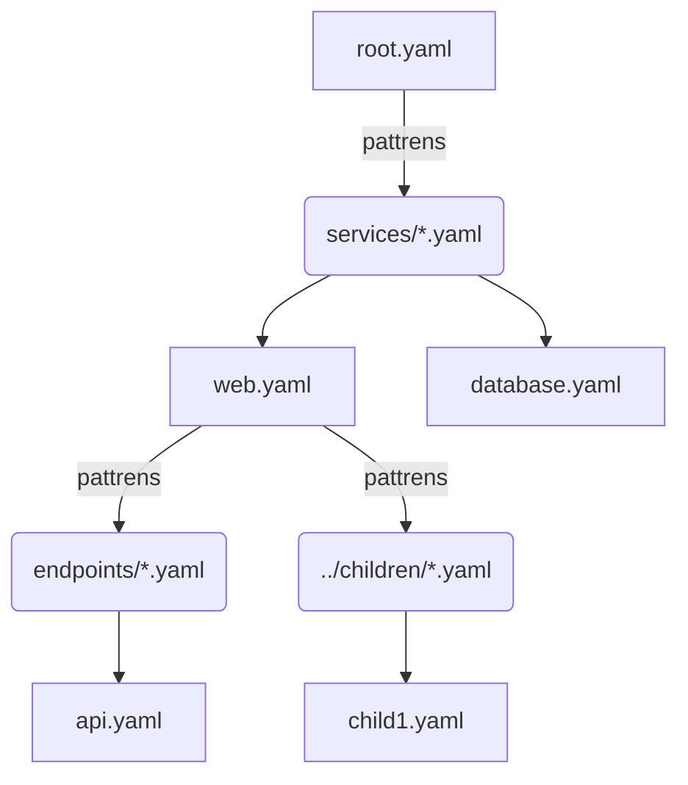

# 数据树渲染示例

此文档介绍`DataHandler`如何构建一个字典树，以及`DataDrivenGenerator`如何递归渲染字典树。

## 1. 简介

- **文件树**：DataHandler通过指定的`root_path`，将构建一个由`DirectoryNode`和`FileNode`组成的[文件树](#21-filenodetree)
- **字典树**：通过在字典中预留一个键`preserved_children_key`, 构建一个由DataNode组成的[字典树](#22-datanodetree)

## 2. 树结构

### 2.1 FileNodeTree

通过遍历config中的`root_path`，构建一个文件树

```txt
==============Serialized File Tree==============
D:\python\code\DataDrivenFileGenerator\modules\examples\3_plugin_addition\source\data/
  root.yaml
  children_0/
    ch0.yaml
  children_1/
    ch1.yaml
```

文件树用来处理文件之间的物理位置关系，包括：

- 获取相对地址, 如从B节点到A节点的相对路径
- 获取绝对地址，如从根节点到A节点的路径

### 2.2 DataNodeTree

DataNode通过config中指定的`preserved_children_key`指定当前节点的子节点, 在**YAML**中定义如下：

```yaml
CHILDREN_PATH: List[ Union[List[str], str] ]
```

#### 2.2.1 通配符

str字符串指定子文件的位置，其可以包括`*`和`**`通配符

> \*\.yaml代表当前文件夹下的所有\.yaml为后缀的文件
> \*\*则表示递归遍历所有子节点，如 \*\*/\*\.yaml表示当前文件夹下的所有yaml及其子目录下的yaml文件

### 2.2.2 子节点分组

在读取完子节点后，将会根据外层List对子节点进行分组，并且在数据中使用`f"{preserved_children_key}{index}"`在数据中进行标记。

例如对于:

```yaml
CHILDREN_PATH: [
  "endpoints/api1.yaml",
  "endpoints/api2.yaml",
]
```

在**preserved_children_key**: "CHILDREN_CONTEXT"的情况下：

- `endpoints/api1.yaml`的渲染结果将保存在`CHILDREN_CONTEXT[0]`中
- `endpoints/api2.yaml`的渲染结果将保存在`CHILDREN_CONTEXT[1]`中

在模板中可以通过`CHILDREN_CONTEXT[index]`对数据进行引用

```jinja2
<endpoints>
        {{ CHILDREN_CONTEXT[0] | indent(8) }}
</endpoints>
<children1>
    {{ CHILDREN_CONTEXT[1] | indent(8) }}
</children1>
```

### 2.2.3 DataNode树


