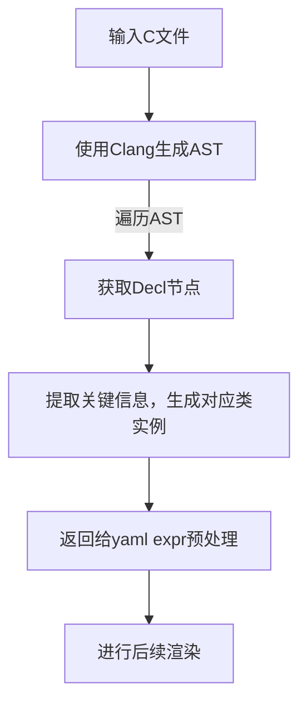

# Clang CIndex Python 接口

本模块基于 libclang，自动化解析 C/C++ 源码，提取结构化声明与预处理信息，适用于代码分析、自动文档生成等场景。

---

## 能力与适用范围

- **完整性**：Clang 能够完整描述 C 语言的语法结构，包括所有类型声明、变量、函数、结构体、联合体、枚举、typedef、注释、源码位置等。AST 节点信息丰富，适合做静态分析、代码生成、文档提取等。
- **节点信息**：每个 AST 节点（Cursor）包含如下典型属性：
  - spelling（名称）
  - kind（节点类型，如 VAR_DECL、STRUCT_DECL 等）
  - type（类型信息，含指针、数组、限定符等）
  - storage_class（存储类型，如 static、extern）
  - location（文件、行、列）
  - raw_comment / brief_comment（注释）
  - extent（源码范围，可提取原始代码片段）
- **C 语言支持**：Clang 的 AST 能完整覆盖 C 语言标准语法，绝大多数 C 代码结构都能被准确还原和遍历。

---

## 工作流程



---

## 变量节点属性示例

假设有如下 C 代码：

```c
// 全局变量，带注释
static const int g_value = 42;
```

其 Clang AST Cursor 节点属性与 C 代码的对应关系如下：

| C 代码内容   | Cursor 属性               | 示例值                         |
| ------------ | ------------------------- | ------------------------------ |
| 名称         | spelling                  | g_value                        |
| 节点类型     | kind                      | VAR_DECL                       |
| 类型         | type.spelling             | const int                      |
| 存储类型     | storage_class             | STATIC                         |
| 限定符       | type.is_const_qualified() | True                           |
| 初始化表达式 | init_expr                 | 42                             |
| 注释         | raw_comment/brief_comment | // 全局变量，带注释            |
| 代码片段     | extend                  | static const int g_value = 42; |

---

## 宏与预处理指令支持及局限

- **支持内容**：
  - #define 宏定义（名称、参数、值）
  - #include 包含指令（文件名、是否系统头文件）
  - 宏实例化（宏展开点、参数）
- **局限性**：
  - 条件编译指令（#ifdef/#ifndef/#if/#elif/#else/#endif）不会出现在 AST 中，无法直接提取条件编译结构。
  - 宏展开仅能获取到宏实例化点及参数，无法还原复杂的宏替换逻辑。
  - 预处理流程本身（如 include 路径搜索、宏递归替换等）不在 AST 结果中体现。


---

## 典型用法

```python
from modules.plugins.clang.extractor import ClangExtractor

extractor = ClangExtractor("libclang.dll 路径")
result = extractor.extract(
    "test.c",
    c_args=["-Iinclude_path"],
    debug_level=1,
    main_file_only=True,
    user_macro_only=True,
)
print(result["structs"])
print(result["variables"])
print(result["preprocessing"]["macro_definitions"])
```

源代码预览(test_struct.c)：

```c
#define VAR(TYPE, STORAGE) TYPE

struct Point
{
    int x;
    int y;
};

typedef struct Rectangle
{
    struct Point top_left;
    struct Point bottom_right;
} Rectangle;

struct UART_REG
{
    unsigned int DATA : 8;  // 数据寄存器
    unsigned int STATUS : 8;
    unsigned int CONTROL : 8;    // 控制寄存器
    unsigned int BAUD_RATE : 8;  // 波特率寄存器
    int          data[100];
};

struct Point pt = { 1, 2 };

Rectangle rect = { { 0, 0 }, { 10, 10 } };

VAR(Rectangle, AUTO) rect2 = { { 1, 1 }, { 5, 5 } };
```


AST树预览(test_struct.c)：
```text
Cursor Tree:
└── TRANSLATION_UNIT .\test\test_struct.c
    ... 
    ... # 省略编译器相关宏
    ...
    ├── MACRO_DEFINITION VAR @ .\test\test_struct.c:1:9
    ├── MACRO_INSTANTIATION VAR @ .\test\test_struct.c:28:1
    ├── STRUCT_DECL Point @ .\test\test_struct.c:3:8
    │   ├── FIELD_DECL x @ .\test\test_struct.c:5:9
    │   └── FIELD_DECL y @ .\test\test_struct.c:6:9
    ├── STRUCT_DECL Rectangle @ .\test\test_struct.c:9:16
    │   ├── FIELD_DECL top_left @ .\test\test_struct.c:11:18
    │   │   └── TYPE_REF struct Point @ .\test\test_struct.c:11:12
    │   └── FIELD_DECL bottom_right @ .\test\test_struct.c:12:18
    │       └── TYPE_REF struct Point @ .\test\test_struct.c:12:12
    ├── TYPEDEF_DECL Rectangle @ .\test\test_struct.c:13:3
    │   └── STRUCT_DECL Rectangle @ .\test\test_struct.c:9:16
    │       ├── FIELD_DECL top_left @ .\test\test_struct.c:11:18
    │       │   └── TYPE_REF struct Point @ .\test\test_struct.c:11:12
    │       └── FIELD_DECL bottom_right @ .\test\test_struct.c:12:18
    │           └── TYPE_REF struct Point @ .\test\test_struct.c:12:12
    ├── STRUCT_DECL UART_REG @ .\test\test_struct.c:15:8
    │   ├── FIELD_DECL DATA @ .\test\test_struct.c:17:18
    │   │   └── INTEGER_LITERAL <anon> @ .\test\test_struct.c:17:25
    │   ├── FIELD_DECL STATUS @ .\test\test_struct.c:18:18
    │   │   └── INTEGER_LITERAL <anon> @ .\test\test_struct.c:18:27
    │   ├── FIELD_DECL CONTROL @ .\test\test_struct.c:19:18
    │   │   └── INTEGER_LITERAL <anon> @ .\test\test_struct.c:19:28
    │   ├── FIELD_DECL BAUD_RATE @ .\test\test_struct.c:20:18
    │   │   └── INTEGER_LITERAL <anon> @ .\test\test_struct.c:20:30
    │   └── FIELD_DECL data @ .\test\test_struct.c:21:18
    │       └── INTEGER_LITERAL <anon> @ .\test\test_struct.c:21:23
    ├── VAR_DECL pt @ .\test\test_struct.c:24:14
    │   ├── TYPE_REF struct Point @ .\test\test_struct.c:24:8
    │   └── INIT_LIST_EXPR <anon> @ .\test\test_struct.c:24:19
    │       ├── INTEGER_LITERAL <anon> @ .\test\test_struct.c:24:21
    │       └── INTEGER_LITERAL <anon> @ .\test\test_struct.c:24:24
    ├── VAR_DECL rect @ .\test\test_struct.c:26:11
    │   ├── TYPE_REF Rectangle @ .\test\test_struct.c:26:1
    │   └── INIT_LIST_EXPR <anon> @ .\test\test_struct.c:26:18
    │       ├── INIT_LIST_EXPR <anon> @ .\test\test_struct.c:26:20
    │       │   ├── INTEGER_LITERAL <anon> @ .\test\test_struct.c:26:22
    │       │   └── INTEGER_LITERAL <anon> @ .\test\test_struct.c:26:25
    │       └── INIT_LIST_EXPR <anon> @ .\test\test_struct.c:26:30
    │           ├── INTEGER_LITERAL <anon> @ .\test\test_struct.c:26:32
    │           └── INTEGER_LITERAL <anon> @ .\test\test_struct.c:26:36
    └── VAR_DECL rect2 @ .\test\test_struct.c:28:22
        ├── TYPE_REF Rectangle @ .\test\test_struct.c:28:1
        └── INIT_LIST_EXPR <anon> @ .\test\test_struct.c:28:30
            ├── INIT_LIST_EXPR <anon> @ .\test\test_struct.c:28:32
            │   ├── INTEGER_LITERAL <anon> @ .\test\test_struct.c:28:34
            │   └── INTEGER_LITERAL <anon> @ .\test\test_struct.c:28:37
            └── INIT_LIST_EXPR <anon> @ .\test\test_struct.c:28:42
                ├── INTEGER_LITERAL <anon> @ .\test\test_struct.c:28:44
                └── INTEGER_LITERAL <anon> @ .\test\test_struct.c:28:47
```

解析结果预览:
```text
Rectangle rect2 = { { 1, 1 }, { 5, 5 } }
  Raw Code: VAR(Rectangle, AUTO) rect2 = { { 1, 1 }, { 5, 5 } }

struct UART_REG {DATA: unsigned int : 8, STATUS: unsigned int : 8, CONTROL: unsigned int : 8, BAUD_RATE: unsigned int : 8, data: int[100]}

Raw Code: struct UART_REG
{
    unsigned int DATA : 8;  // 数据寄存器
    unsigned int STATUS : 8;
    unsigned int CONTROL : 8;    // 控制寄存器
    unsigned int BAUD_RATE : 8;  // 波特率寄存器
    int          data[100];
}
...


Macro Instantation: VAR(Rectangle, AUTO)
```

---

## 依赖

- Python clang 包（pip install clang）
- libclang 动态库

详细参数与扩展用法见 extractor.py 注释。

## 可能的问题/需求

- 宏不展开：
   - **需求**：需要展示源代码内容，宏定义不展开，例如`int a = MAX;`。
   - **问题的原因**: Clang AST 树中的值为宏展开后的值，无法直接获取未展开的宏定义。
   - **解决方案**：对于需要获取未展开代码的场景，可以使用`cursor.extend`获取源文件代码。

- 重构代码布局，但保留宏
   - **需求**：重构代码布局，例如将一般C样式`int a = ...;`重构为AUTOSAR宏定义样式`VAR(...) a = ...;`。
   - **问题的原因**: Clang AST 树中的宏定义会被展开，无法直接获取原始宏定义。
   - **解决方案**：可能可以在解析AST时，通过AST extension位置信息以及宏实例位置信息判断，保留对应位置的宏定义。例如在判断到`int a = MAX;`时，通过判断a的`init_expr`在源代码中的位置与某一个宏实例是否一致(即代码开头位置与结束位置完全重合)，一致则保留`MAX`字符串。