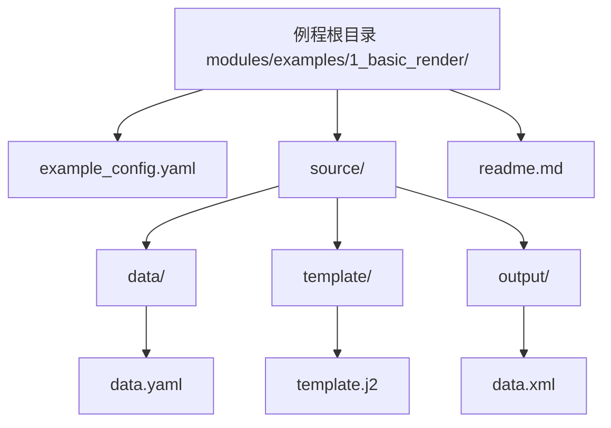

# 1_basic_render
---
这是一个基本的模版渲染示例，展示了如何使用数据驱动模版生成器进行简单的模版渲染。

## 1.目录结构




## 2.配置文件说明

- `data_type: yaml`  
  数据源类型，指定为 YAML 格式。
- `data_config.file_root_path: .\source\data`  
  数据文件的根目录。
- `data_config.file_pattern: ["*.yaml"]`  
  匹配所有 YAML 数据文件。
- `data_config.encoding: utf-8`  
  数据文件编码格式。
- `template_type: jinja`  
  模板引擎类型，指定为 Jinja2。
- `template_config.template_dir: .\source\template`  
  模板文件所在目录。
- `template_config.autoescape: false`  
  关闭自动转义。
- `pattern: ["*.yaml"]`  
  需要处理的数据文件模式。
- `output_dir: .\source\output`  
  输出文件目录。
- `output_file_extension: "xml"`  
  输出文件扩展名。
- `preserved_template_key: TEMPLATE`  
  数据中指定模板路径的键名。
- `preserved_children_key: CHILDREN`  
  数据中子节点的键名。
- `preserved_children_content_key: CHILDREN_CONTENT`  
  模板中引用子节点内容的键名。


## 3.运行

1. 进入本例程目录：`cd modules/examples/1_basic_render`
2. 执行命令：`python ../../cli/cli.py example_config.yaml`
3. 输出文件将在 `source/output/` 目录下生成


## 4.输入数据说明

- 输入数据位于 `source/data/data.yaml`
- 数据格式为 YAML，内容为待渲染的数据结构
- 需包含模板路径（TEMPLATE）、子节点（CHILDREN）等字段


## 5.输出数据说明

- 输出文件位于 `source/output/` 目录
- 主要输出为 `data.xml`、`data.yaml.txt`、`data.yaml.xml`
- 输出内容为模板渲染后的结果


## 6.关键代码片段

```python
# 关键代码片段（cli 调用）
from modules.core.data_driven_generator import DataDrivenGenerator, DataDrivenGeneratorConfig

config = DataDrivenGeneratorConfig(
    data_type="yaml",
    data_config={"file_root_path": "./source/data", "file_pattern": ["*.yaml"], "encoding": "utf-8"},
    template_type="jinja",
    template_config={"template_dir": "./source/template", "autoescape": False},
    preserved_template_key="TEMPLATE",
    preserved_children_key="CHILDREN",
    preserved_children_content_key="CHILDREN_CONTENT"
)
generator = DataDrivenGenerator(config)
results = generator.render(pattern=["*.yaml"])
# 保存输出略
```