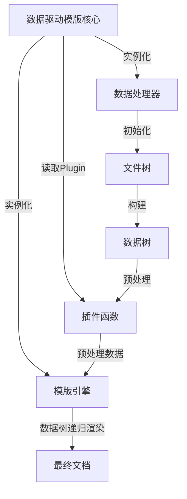

# 数据驱动模版生成器
---
`数据驱动模版生成器`是一个由数据字典以及模版引擎构成的，支持模版嵌套以及自定义函数插件的工具

## 1.Purpose

任意可阅读模版文档的数据驱动生成，前期完成模版的创建，数据模版创建，插件创建。后期只需要进行模版的拼接以及填写即可快速修改文件内容，并通过插件函数自定义数据处理逻辑

## 2.Core Concepts

- **数据处理器**:数据处理器由python脚本实现，核心目标是以任何方式读取一个数据文件到一个python字典，同时这个字典需要使用`preserved_key`来向`模版引擎`指示子模版路径，以及向`数据驱动模版核心`指示子模版路径
- **模版引擎**:模版引擎(Jinja)通过python进行调用，核心目标是将一个模版文件与一个数据字典进行渲染，生成一个最终的文档
- **数据驱动模版核心**:由`数据处理器`与`模版引擎`组成，是两者运行之间的桥梁。负责调用各个Handler以及进行数据的处理
- **文件树**:文件树是一个数据结构，其包含两个类型: `DirectoryNode`以及`FileNode`。其构建了一个windows文件系统下某一目录的递归文件树。文件树仅在DataHandler为(`YamlHandler`)时被构建
- **数据树**:数据树是一个数据结构，用来存储节点字典数据以及描述节点关系。其包含`DirectoryNode`， 同时包含一个额外的data字典字段。数据节点树由文件树下的`FileNode`生成，且一一对应。可以允许存在匿名数据节点
- **插件函数**:插件函数是一个python脚本，其核心目标是提供一个自定义函数的接口，供`{core_concepts[2].name}`在进行模版渲染前，对数据字典进行预处理。通过在运行时收集modules/plugins/*.py的所有Plugin类提供的函数接口，供预处理时进行函数调用

## 3.Architecture Overview

- **主流程图**:



## 4.Key Features

- ****:

## 5.Usage

```shell
python module/cli/cli.py <config_file_path>
```


## 6.Installation

1. 安装python
2. 安装Jinja2
3. 安装Yaml
